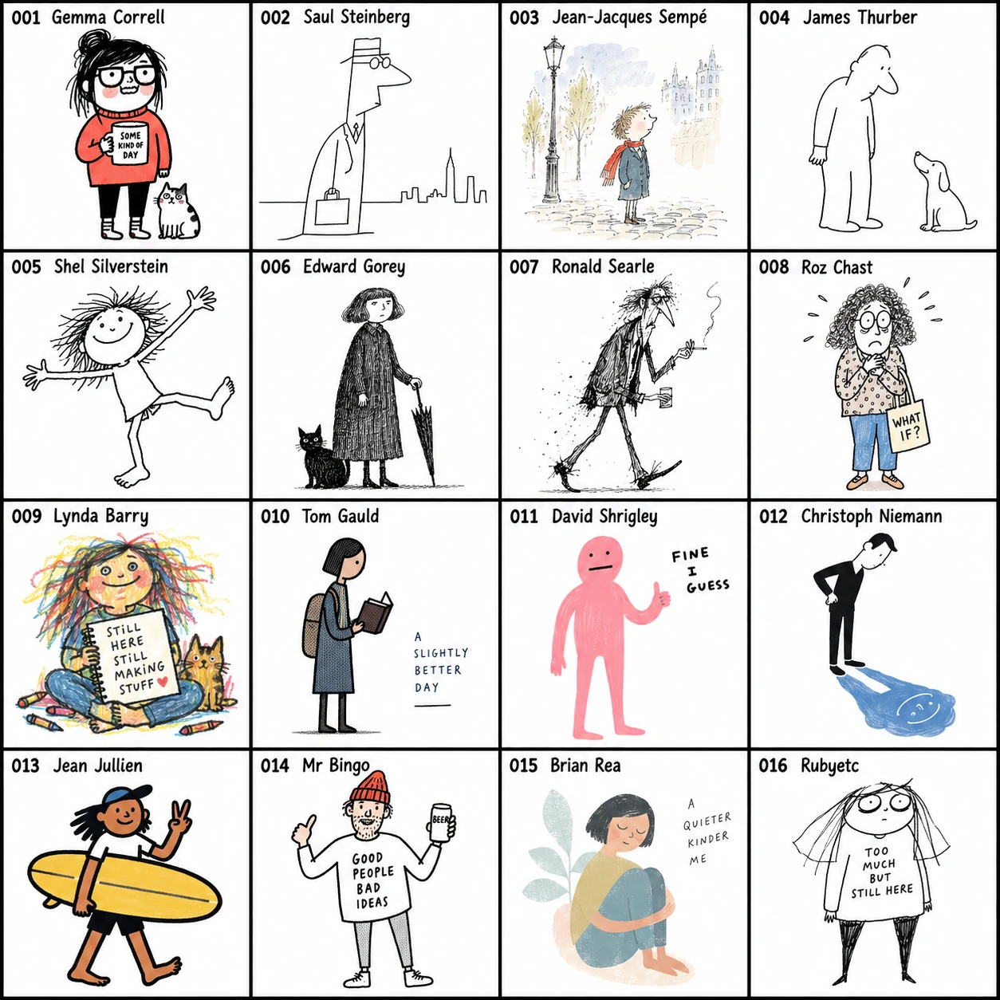
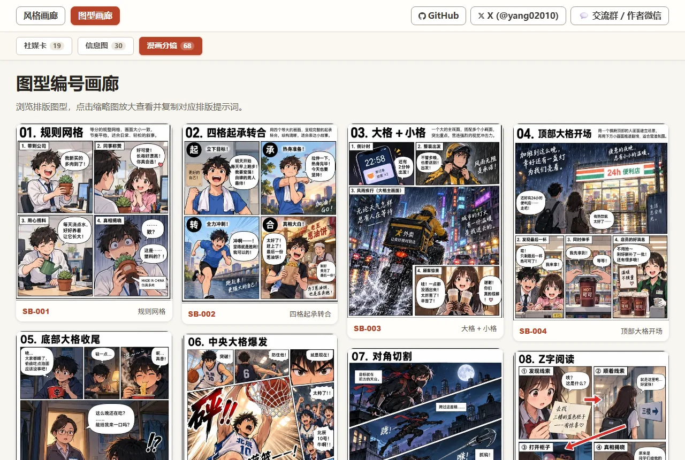

# 手绘风格提示词库

不会描述画风，也能快速做出有辨识度的图片。

这里整理了 **001–274 种手绘风格**。先选一个编号，再告诉 Skill 你想表现的主题，就能得到带有风格名称的中文和英文提示词，直接交给支持生图的 AI 使用。

## 它适合谁

- 不知道该怎么描述画风的创作者
- 做公众号、小红书、短视频和品牌内容的人
- 想让自己的图片保持稳定视觉气质的人

## 它解决什么问题

很多人只能说“可爱一点”“文艺一点”，每次生成结果却不一样；同一个主题换一次 AI，画风也会漂移；面对一整页参考图，又很难准确说出自己喜欢哪一种。

这个风格库把“凭感觉选图”变成“记住一个编号”。你不需要背诵画风名称，也不需要自己拼提示词。

## 安装

安装时必须选择仓库根目录 `.`，不要只安装 `skills/handdraw-style-prompter/` 子目录；根目录同时包含画廊、拼图和编号参考图。

```text
$skill-installer install --repo yang0/handraw-style --path . --name handdraw-style-prompter --ref master
```

## 这个 Skill 怎么用

1. 打开[风格编号画廊](skills/handdraw-style-prompter/gallery/index.html)，浏览风格图片；需要先选排版时可打开[图型编号画廊](skills/handdraw-style-prompter/gallery/layouts.html)。
2. 记下喜欢的编号，例如 `041`。
3. 输入“编号 + 主题”，例如：`041号风格，主题：秋天的第一杯奶茶`。
4. 得到带风格名称的中文和英文提示词。
5. 复制到你正在使用的生图 AI 中。

## 两种模式，随时切换

同一个编号和主题可以随时在两种模式之间切换，无需重新选择风格。

- **纯图模式**：让主题决定画面内容，适合只需要插画、不需要画中文字的场景。示例：`纯图模式，041号风格，主题：秋天的第一杯奶茶`。
- **图文模式**：保留你写下的主题原文，让文字参与画面构图，适合金句、海报与社交媒体配图。示例：`图文模式，267号风格，主题：有很多事你当时想不通，别着急，过段时间你可能就忘了。`。

切换时直接说“切换为纯图模式”或“切换为图文模式”即可；不指定时默认使用纯图模式。

### 图文模式演示

下图展示了文字与插图共同构图的效果；它仅作为图文模式演示，不绑定任何编号风格。


Skill 默认只负责把想法变成提示词；你明确要求“生图”时，会先判断当前生图模型能否仅凭风格名称激活画风。能激活就不传参考图，不能确认或不能激活就传对应编号的单图，避免模型把参考图中的主体和构图一起锁死。

当前已按 `gpt-image-2` 建立首轮能力清单，生图优先级为：作者名称 + 风格名称 → 再加正向核心风格特征 → 最后传对应编号的单图。像 `001` 这类可由名称激活的风格不传图；没有核心特征或仍不足以激活的编号才传图。这个判断与作者是否著名、是否在世无关。

导入的新风格资源按每 200 个编号分目录保存：例如 `001–200` 在 `images/individual/001-200/`，`201–400` 在 `images/individual/201-400/`。同一编号的单图和四宫格参考图始终在同一个目录。

## 三个例子

```text
041号风格，主题：秋天的第一杯奶茶
210号风格，主题：小男孩在雪地里点鞭炮
193号风格，主题：大唐夜宴
```

## 风格精选预览

这里展示了手绘风格的精选预览拼图（001–016）：



- 👉 **[查看完整风格列表（274 种风格 Markdown 详细表格与特征描述）](styles_200_reorganized.md)**
- 🎨 **[打开手绘风格编号画廊（支持编号检索、放大预览与提示词复制）](skills/handdraw-style-prompter/gallery/index.html)**

## 排版图型展示

除了丰富的手绘风格，本库还收录了 **117 种排版图型**，涵盖社交卡片、数据长图与分镜故事，支持一键组合风格与排版出图。

### 1. 社媒卡（Social Cards · 19 种）

适合小红书、朋友圈、公众号配图及观点金句卡片，结构包含上下图文、文案主导、双格对照等。


👉 **[查看更多社媒卡图型](skills/handdraw-style-prompter/gallery/layouts.html#social-card)**

---

### 2. 信息图（Infographics · 30 种）

适合知识科普、对比清单、流程步骤及数据展示，结构包含金字塔层级、中心主图标注、多行多列对比等。


👉 **[查看更多信息图图型](skills/handdraw-style-prompter/gallery/layouts.html#infographic)**

---

### 3. 漫画分镜（Comic Storyboards · 68 种）

适合多格叙事、条漫剧情、情绪递进及动态视觉，包含规则四格、起承转合、大格冲击、对角切割等专业分镜。



👉 **[查看更多漫画分镜图型](skills/handdraw-style-prompter/gallery/layouts.html#comic-storyboard)**

---

💡 **[进入图型编号画廊，浏览全部 117 种排版并复制提示词 ↗](skills/handdraw-style-prompter/gallery/layouts.html)**

## 作者与社群交流

- **微信交流群 / 作者微信**：添加请备注 **手绘**，拉你进创作者交流群

  

- X：[@yang02010](https://x.com/yang02010)
